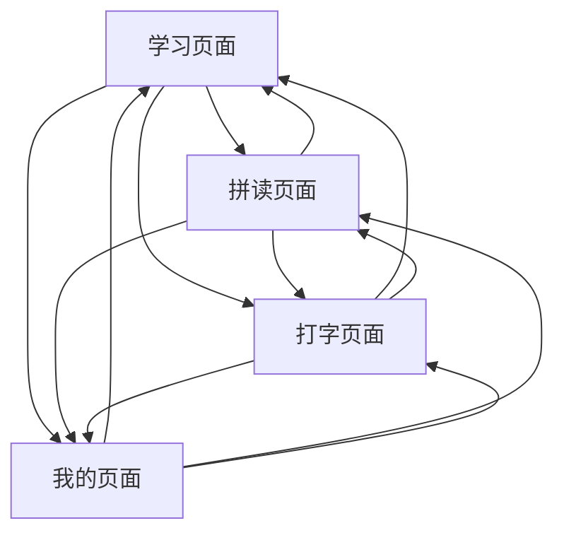

# 拼音学习助手 - 产品需求文档

## 1. 产品概述
拼音学习助手是一款专为中文拼音学习设计的安卓移动应用，帮助用户系统性地学习和练习汉语拼音。
- 主要解决中文拼音学习难题，为初学者和需要巩固拼音基础的用户提供全面的学习工具。
- 目标用户包括儿童、外国人学中文、以及需要纠正拼音发音的成年人。
- 产品目标是成为最受欢迎的拼音学习移动应用，帮助用户快速掌握标准拼音发音。

## 2. 核心功能

### 2.1 用户角色
本产品为单用户应用，无需复杂的用户角色区分，所有用户享有相同的功能权限。

### 2.2 功能模块
拼音学习助手包含以下主要页面：
1. **学习页面**：拼音基础知识学习、声母韵母教学、拼音规则讲解
2. **拼读页面**：拼音拼读练习、发音训练、听音识字
3. **打字页面**：拼音输入练习、打字速度训练、词汇输入测试
4. **我的页面**：学习进度查看、设置选项、学习统计

### 2.3 页面详情

| 页面名称 | 模块名称 | 功能描述 |
|---------|---------|----------|
| 学习页面 | 声母学习 | 展示23个声母，包含发音示例、口型图解、练习题目 |
| 学习页面 | 韵母学习 | 展示24个韵母，包含单韵母、复韵母、鼻韵母的发音教学 |
| 学习页面 | 声调练习 | 四声调教学，包含声调符号、发音规律、实例演示 |
| 拼读页面 | 拼音拼读 | 随机生成拼音组合，用户进行拼读练习，支持语音识别 |
| 拼读页面 | 听音识字 | 播放拼音发音，用户选择对应的汉字或拼音 |
| 拼读页面 | 发音评测 | 用户跟读拼音，系统评估发音准确度并给出反馈 |
| 打字页面 | 拼音输入 | 提供虚拟键盘，练习拼音输入法的使用 |
| 打字页面 | 速度测试 | 计时拼音打字练习，统计输入速度和准确率 |
| 打字页面 | 词汇练习 | 常用词汇的拼音输入练习，提升实用性 |
| 我的页面 | 学习统计 | 显示学习时长、练习次数、进度完成情况 |
| 我的页面 | 设置中心 | 音量调节、语音设置、字体大小调整 |
| 我的页面 | 帮助说明 | 应用使用指南、拼音学习方法介绍 |

## 3. 核心流程

用户主要操作流程：
1. 用户打开应用进入学习页面，选择声母、韵母或声调模块进行基础学习
2. 完成基础学习后，进入拼读页面进行实战练习，包括拼读、听音识字和发音评测
3. 通过打字页面练习拼音输入法，提升实际应用能力
4. 在我的页面查看学习进度，调整应用设置

## 4. 用户界面设计

### 4.1 设计风格
- 主色调：蓝色系 (#4e54c8 作为主色)
- 辅助色：浅蓝色 (#e3f2fd) 和白色 (#ffffff)
- 按钮样式：圆角矩形，大尺寸设计，便于触摸操作
- 字体：默认字体大小24px，确保清晰易读
- 布局风格：卡片式设计，底部导航栏布局
- 图标风格：简洁的线性图标，配合适当的彩色装饰

### 4.2 页面设计概览

| 页面名称 | 模块名称 | UI元素 |
|---------|---------|--------|
| 学习页面 | 声母学习 | 大字体声母卡片、播放按钮、口型动画、蓝色主题配色 |
| 学习页面 | 韵母学习 | 韵母展示卡片、发音示例按钮、分类标签、渐变背景 |
| 拼读页面 | 拼音拼读 | 拼音显示区域、录音按钮、评分显示、进度条 |
| 拼读页面 | 听音识字 | 音频播放控件、选择题按钮、正确答案提示、计分板 |
| 打字页面 | 拼音输入 | 虚拟键盘、输入框、实时反馈、速度统计面板 |
| 我的页面 | 学习统计 | 圆形进度图、数据卡片、成就徽章、时间轴显示 |

### 4.3 响应式设计
应用采用移动端优先设计，专为安卓手机屏幕优化，支持触摸交互，所有按钮和交互元素都采用大尺寸设计以提升用户体验。