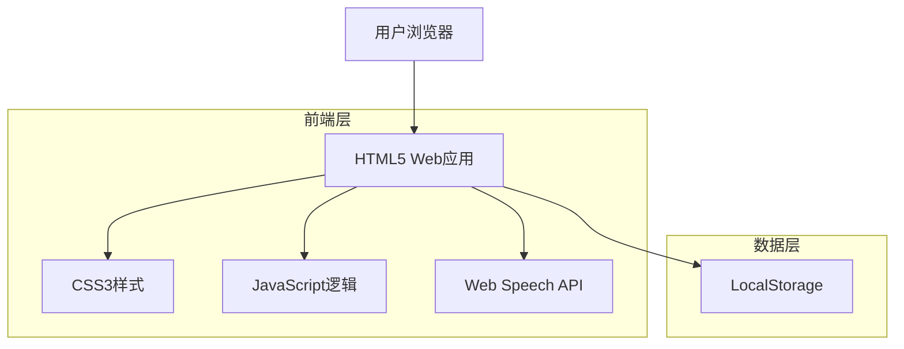

# 拼音学习助手 - 技术架构文档

## 1. 架构设计



## 2. 技术描述

* 前端：HTML5 + CSS3 + JavaScript (ES6+)

* 语音功能：Web Speech API (SpeechSynthesis)

* 数据存储：LocalStorage (浏览器内置)

* 开发工具：现代浏览器 + 文本编辑器

## 3. 页面结构

| 页面标识         | 用途                 |
| ------------ | ------------------ |
| learn-tab    | 学习页面，展示拼音基础知识学习内容  |
| practice-tab | 拼读页面，提供拼音拼读和发音练习功能 |

## 4. 项目初始化步骤

### 4.1 环境准备

确保已安装以下环境：

* 现代浏览器 (Chrome, Firefox, Safari, Edge)

* 文本编辑器 (VS Code, Sublime Text等)

* 本地HTTP服务器 (可选，用于开发调试)

### 4.2 项目创建步骤

```bash
# 1. 创建项目目录
mkdir HanyupinyinLearningHelper
cd HanyupinyinLearningHelper

# 2. 创建基础文件结构
mkdir css js
touch index.html css/style.css js/app.js

# 3. 启动本地服务器 (可选)
# 使用Python
python -m http.server 8000
# 或使用Node.js
npx http-server

# 4. 在浏览器中访问
# http://localhost:8000
```

### 4.3 核心文件结构

```
HanyupinyinLearningHelper/
├── index.html           # 主入口文件
├── css/
│   ├── style.css       # 主样式文件
│   └── components.css  # 组件样式
├── js/
│   ├── app.js          # 主应用逻辑
│   ├── data.js         # 拼音数据
│   ├── speech.js       # 语音功能
│   └── utils.js        # 工具函数
├── assets/             # 静态资源
│   └── icons/          # 图标文件
└── README.md           # 项目说明
```

## 5. 核心代码实现

### 5.1 主入口文件 (index.html)

```html
<!DOCTYPE html>
<html lang="zh-CN">
<head>
    <meta charset="UTF-8">
    <meta name="viewport" content="width=device-width, initial-scale=1.0">
    <title>拼音学习助手</title>
    <link rel="stylesheet" href="css/style.css">
    <link rel="stylesheet" href="css/components.css">
</head>
<body>
    <div id="app">
        <!-- 顶部标题栏 -->
        <header class="header">
            <h1>拼音学习助手</h1>
        </header>
        
        <!-- 主内容区域 -->
        <main class="main-content">
            <!-- 学习页面 -->
            <div id="learn-tab" class="tab-content active">
                <!-- 学习页面内容 -->
            </div>
            
            <!-- 拼读页面 -->
            <div id="practice-tab" class="tab-content">
                <!-- 拼读页面内容 -->
            </div>
        </main>
        
        <!-- 底部导航栏 -->
        <nav class="bottom-nav">
            <button class="nav-btn active" data-tab="learn-tab">
                <span class="nav-icon">📚</span>
                <span class="nav-text">学习</span>
            </button>
            <button class="nav-btn" data-tab="practice-tab">
                <span class="nav-icon">🎤</span>
                <span class="nav-text">拼读</span>
            </button>
        </nav>
    </div>
    
    <script src="js/data.js"></script>
    <script src="js/speech.js"></script>
    <script src="js/utils.js"></script>
    <script src="js/app.js"></script>
</body>
</html>
```

### 5.2 主样式文件 (css/style.css)

```css
:root {
  --primary-color: #4e54c8;
  --primary-light: #e3f2fd;
  --secondary-color: #2196f3;
  --surface-color: #ffffff;
  --background-color: #f5f5f5;
  --text-color: #333333;
  --text-light: #666666;
  --border-color: #e0e0e0;
  --shadow: 0 2px 8px rgba(0,0,0,0.1);
}

* {
  margin: 0;
  padding: 0;
  box-sizing: border-box;
}

body {
  font-family: -apple-system, BlinkMacSystemFont, 'Segoe UI', Roboto, sans-serif;
  font-size: 24px;
  line-height: 1.5;
  color: var(--text-color);
  background-color: var(--background-color);
}

#app {
  display: flex;
  flex-direction: column;
  height: 100vh;
}

.header {
  background-color: var(--primary-color);
  color: white;
  padding: 20px;
  text-align: center;
  box-shadow: var(--shadow);
}

.header h1 {
  font-size: 28px;
  font-weight: bold;
}

.main-content {
  flex: 1;
  overflow-y: auto;
  padding: 20px;
}

.tab-content {
  display: none;
}

.tab-content.active {
  display: block;
}

.bottom-nav {
  display: flex;
  background-color: var(--surface-color);
  border-top: 1px solid var(--border-color);
  box-shadow: 0 -2px 8px rgba(0,0,0,0.1);
}

.nav-btn {
  flex: 1;
  display: flex;
  flex-direction: column;
  align-items: center;
  padding: 15px 10px;
  border: none;
  background: none;
  cursor: pointer;
  transition: all 0.3s ease;
}

.nav-btn:hover {
  background-color: var(--primary-light);
}

.nav-btn.active {
  color: var(--primary-color);
  background-color: var(--primary-light);
}

.nav-icon {
  font-size: 32px;
  margin-bottom: 5px;
}

.nav-text {
  font-size: 16px;
  font-weight: bold;
}
```

### 5.3 拼音数据文件 (js/data.js)

```javascript
// 拼音数据
const pinyinData = {
  // 声母 23个
  initials: [
    'b', 'p', 'm', 'f', 'd', 't', 'n', 'l',
    'g', 'k', 'h', 'j', 'q', 'x', 'zh', 'ch',
    'sh', 'r', 'z', 'c', 's', 'y', 'w'
  ],
  
  // 韵母 24个
  finals: [
    'a', 'o', 'e', 'i', 'u', 'ü',
    'ai', 'ei', 'ui', 'ao', 'ou', 'iu',
    'ie', 'üe', 'er', 'an', 'en', 'in',
    'un', 'ün', 'ang', 'eng', 'ing', 'ong'
  ],
  
  // 整体认读音节 16个
  wholeReading: [
    'zhi', 'chi', 'shi', 'ri', 'zi', 'ci', 'si',
    'yi', 'wu', 'yu', 'ye', 'yue', 'yuan',
    'yin', 'yun', 'ying'
  ],
  
  // 声调符号
  tones: {
    1: { name: '一声', symbol: 'ˉ' },
    2: { name: '二声', symbol: 'ˊ' },
    3: { name: '三声', symbol: 'ˇ' },
    4: { name: '四声', symbol: 'ˋ' }
  },
  
  // 汉字示例
  examples: {
    'ba': { 1: '八', 2: '拔', 3: '把', 4: '爸' },
    'ma': { 1: '妈', 2: '麻', 3: '马', 4: '骂' },
    'da': { 1: '搭', 2: '达', 3: '打', 4: '大' },
    'la': { 1: '拉', 2: '来', 3: '老', 4: '辣' }
  }
};

// 获取声调音节
function getTonedSyllable(syllable, tone) {
  const toneMarks = {
    'a': ['a', 'á', 'ǎ', 'à'],
    'o': ['o', 'ó', 'ǒ', 'ò'],
    'e': ['e', 'é', 'ě', 'è'],
    'i': ['i', 'í', 'ǐ', 'ì'],
    'u': ['u', 'ú', 'ǔ', 'ù'],
    'ü': ['ü', 'ǘ', 'ǔ', 'ǜ']
  };
  
  // 找到主要元音并添加声调
  for (let vowel in toneMarks) {
    if (syllable.includes(vowel)) {
      return syllable.replace(vowel, toneMarks[vowel][tone - 1]);
    }
  }
  
  return syllable;
}
```

### 5.4 语音功能文件 (js/speech.js)

```javascript
// 语音合成功能
class SpeechManager {
  constructor() {
    this.synth = window.speechSynthesis;
    this.voices = [];
    this.loadVoices();
  }
  
  loadVoices() {
    this.voices = this.synth.getVoices();
    
    // 如果voices为空，等待voiceschanged事件
    if (this.voices.length === 0) {
      this.synth.addEventListener('voiceschanged', () => {
        this.voices = this.synth.getVoices();
      });
    }
  }
  
  // 获取中文语音
  getChineseVoice() {
    return this.voices.find(voice => 
      voice.lang.includes('zh') || 
      voice.name.includes('Chinese')
    ) || this.voices[0];
  }
  
  // 朗读文本
  speak(text, options = {}) {
    // 停止当前朗读
    this.synth.cancel();
    
    const utterance = new SpeechSynthesisUtterance(text);
    
    // 设置语音参数
    utterance.voice = this.getChineseVoice();
    utterance.rate = options.rate || 0.8;
    utterance.pitch = options.pitch || 1;
    utterance.volume = options.volume || 1;
    
    // 错误处理
    utterance.onerror = (event) => {
      console.error('语音合成错误:', event.error);
    };
    
    // 开始朗读
    this.synth.speak(utterance);
  }
  
  // 停止朗读
  stop() {
    this.synth.cancel();
  }
  
  // 检查是否支持语音合成
  isSupported() {
    return 'speechSynthesis' in window;
  }
}

// 创建全局语音管理器实例
const speechManager = new SpeechManager();
```

### 5.5 主应用逻辑 (js/app.js)

```javascript
// 应用主逻辑
class PinyinApp {
  constructor() {
    this.currentTab = 'learn-tab';
    this.currentCategory = 'initials';
    this.selectedInitial = 'b';
    this.selectedFinal = 'a';
    this.init();
  }
  
  init() {
    this.setupNavigation();
    this.renderLearnTab();
    this.renderPracticeTab();
  }
  
  // 设置导航
  setupNavigation() {
    const navBtns = document.querySelectorAll('.nav-btn');
    navBtns.forEach(btn => {
      btn.addEventListener('click', (e) => {
        const targetTab = e.currentTarget.dataset.tab;
        this.switchTab(targetTab);
      });
    });
  }
  
  // 切换标签页
  switchTab(tabId) {
    // 隐藏所有标签页
    document.querySelectorAll('.tab-content').forEach(tab => {
      tab.classList.remove('active');
    });
    
    // 显示目标标签页
    document.getElementById(tabId).classList.add('active');
    
    // 更新导航按钮状态
    document.querySelectorAll('.nav-btn').forEach(btn => {
      btn.classList.remove('active');
    });
    document.querySelector(`[data-tab="${tabId}"]`).classList.add('active');
    
    this.currentTab = tabId;
  }
  
  // 渲染学习页面
  renderLearnTab() {
    const learnTab = document.getElementById('learn-tab');
    learnTab.innerHTML = `
      <div class="learn-container">
        <div class="category-selector">
          <button class="category-btn active" data-category="initials">声母</button>
          <button class="category-btn" data-category="finals">韵母</button>
          <button class="category-btn" data-category="wholeReading">整体认读</button>
        </div>
        <div class="pinyin-grid" id="pinyin-grid">
          <!-- 拼音卡片将在这里动态生成 -->
        </div>
      </div>
    `;
    
    this.setupCategorySelector();
    this.renderPinyinGrid();
  }
  
  // 设置分类选择器
  setupCategorySelector() {
    const categoryBtns = document.querySelectorAll('.category-btn');
    categoryBtns.forEach(btn => {
      btn.addEventListener('click', (e) => {
        categoryBtns.forEach(b => b.classList.remove('active'));
        e.target.classList.add('active');
        this.currentCategory = e.target.dataset.category;
        this.renderPinyinGrid();
      });
    });
  }
  
  // 渲染拼音网格
  renderPinyinGrid() {
    const grid = document.getElementById('pinyin-grid');
    const data = pinyinData[this.currentCategory];
    
    grid.innerHTML = data.map(pinyin => `
      <button class="pinyin-card" onclick="speechManager.speak('${pinyin}')">
        ${pinyin}
      </button>
    `).join('');
  }
  
  // 渲染拼读页面
  renderPracticeTab() {
    const practiceTab = document.getElementById('practice-tab');
    practiceTab.innerHTML = `
      <div class="practice-container">
        <div class="selection-area">
          <div class="selector">
            <label>声母</label>
            <div class="current-selection">${this.selectedInitial}</div>
            <button class="select-btn" onclick="app.showSelector('initial')">选择</button>
          </div>
          <div class="selector">
            <label>韵母</label>
            <div class="current-selection">${this.selectedFinal}</div>
            <button class="select-btn" onclick="app.showSelector('final')">选择</button>
          </div>
        </div>
        
        <div class="syllable-display">
          <div class="syllable">${this.selectedInitial + this.selectedFinal}</div>
          <button class="speak-btn" onclick="speechManager.speak('${this.selectedInitial + this.selectedFinal}')">
            🔊
          </button>
        </div>
        
        <div class="tone-practice">
          <h3>四声调练习</h3>
          <div class="tone-buttons">
            ${[1,2,3,4].map(tone => `
              <div class="tone-item">
                <button class="tone-btn" onclick="app.practiceTone(${tone})">
                  ${pinyinData.tones[tone].name}
                </button>
                <div class="example-char">
                  ${this.getExampleChar(this.selectedInitial + this.selectedFinal, tone)}
                </div>
              </div>
            `).join('')}
          </div>
        </div>
      </div>
      
      <!-- 选择器模态框 -->
      <div id="selector-modal" class="modal">
        <div class="modal-content">
          <div class="modal-header">
            <h3 id="modal-title">选择声母</h3>
            <button class="close-btn" onclick="app.hideSelector()">&times;</button>
          </div>
          <div class="modal-body" id="selector-list">
            <!-- 选项列表 -->
          </div>
        </div>
      </div>
    `;
  }
  
  // 获取示例汉字
  getExampleChar(syllable, tone) {
    return pinyinData.examples[syllable]?.[tone] || '字';
  }
  
  // 显示选择器
  showSelector(type) {
    const modal = document.getElementById('selector-modal');
    const title = document.getElementById('modal-title');
    const list = document.getElementById('selector-list');
    
    title.textContent = type === 'initial' ? '选择声母' : '选择韵母';
    const data = type === 'initial' ? pinyinData.initials : pinyinData.finals;
    
    list.innerHTML = data.map(item => `
      <button class="selector-item" onclick="app.selectItem('${type}', '${item}')">
        ${item}
      </button>
    `).join('');
    
    modal.style.display = 'block';
  }
  
  // 隐藏选择器
  hideSelector() {
    document.getElementById('selector-modal').style.display = 'none';
  }
  
  // 选择项目
  selectItem(type, item) {
    if (type === 'initial') {
      this.selectedInitial = item;
    } else {
      this.selectedFinal = item;
    }
    
    this.hideSelector();
    this.renderPracticeTab();
  }
  
  // 练习声调
  practiceTone(tone) {
    const syllable = this.selectedInitial + this.selectedFinal;
    const tonedSyllable = getTonedSyllable(syllable, tone);
    speechManager.speak(tonedSyllable);
  }
}

// 初始化应用
const app = new PinyinApp();
```

#### ProfileScreen.js

```javascript
import React from 'react';
import { View, StyleSheet } from 'react-native';
import { Text, Card, List, Avatar } from 'react-native-paper';

const ProfileScreen = () => {
  return (
    <View style={styles.container}>
      <Card style={styles.card}>
        <Card.Content>
          <View style={styles.header}>
            <Avatar.Icon size={80} icon="account" />
            <Text variant="headlineMedium" style={styles.title}>
              我的学习
            </Text>
          </View>
        </Card.Content>
      </Card>
      
      <Card style={styles.card}>
        <List.Item
          title="学习统计"
          description="查看学习进度和成绩"
          left={props => <List.Icon {...props} icon="chart-line" />}
          titleStyle={styles.listTitle}
        />
        <List.Item
          title="设置"
          description="应用设置和偏好"
          left={props => <List.Icon {...props} icon="cog" />}
          titleStyle={styles.listTitle}
        />
        <List.Item
          title="帮助"
          description="使用指南和常见问题"
          left={props => <List.Icon {...props} icon="help-circle" />}
          titleStyle={styles.listTitle}
        />
      </Card>
    </View>
  );
};

const styles = StyleSheet.create({
  container: {
    flex: 1,
    padding: 16,
    backgroundColor: '#f5f5f5',
  },
  card: {
    marginVertical: 8,
  },
  header: {
    alignItems: 'center',
    marginBottom: 16,
  },
  title: {
    marginTop: 16,
    fontSize: 28,
    fontWeight: 'bold',
  },
  listTitle: {
    fontSize: 20,
  },
});

export default ProfileScreen;
```

## 6. 组件样式文件 (css/components.css)

```css
/* 学习页面样式 */
.learn-container {
  max-width: 800px;
  margin: 0 auto;
}

.category-selector {
  display: flex;
  justify-content: center;
  margin-bottom: 30px;
  gap: 10px;
}

.category-btn {
  padding: 12px 24px;
  border: 2px solid var(--primary-color);
  background-color: var(--surface-color);
  color: var(--primary-color);
  border-radius: 25px;
  font-size: 18px;
  font-weight: bold;
  cursor: pointer;
  transition: all 0.3s ease;
}

.category-btn.active,
.category-btn:hover {
  background-color: var(--primary-color);
  color: white;
}

.pinyin-grid {
  display: grid;
  grid-template-columns: repeat(auto-fit, minmax(80px, 1fr));
  gap: 15px;
  max-width: 600px;
  margin: 0 auto;
}

.pinyin-card {
  width: 80px;
  height: 80px;
  border: 2px solid var(--border-color);
  background-color: var(--surface-color);
  border-radius: 12px;
  font-size: 24px;
  font-weight: bold;
  color: var(--text-color);
  cursor: pointer;
  transition: all 0.3s ease;
  box-shadow: var(--shadow);
}

.pinyin-card:hover {
  background-color: var(--primary-light);
  border-color: var(--primary-color);
  transform: translateY(-2px);
  box-shadow: 0 4px 12px rgba(0,0,0,0.15);
}

/* 拼读页面样式 */
.practice-container {
  max-width: 600px;
  margin: 0 auto;
}

.selection-area {
  display: flex;
  justify-content: space-around;
  margin-bottom: 40px;
  gap: 20px;
}

.selector {
  text-align: center;
  flex: 1;
}

.selector label {
  display: block;
  font-size: 18px;
  font-weight: bold;
  margin-bottom: 10px;
  color: var(--text-color);
}

.current-selection {
  font-size: 32px;
  font-weight: bold;
  color: var(--primary-color);
  margin: 15px 0;
  min-height: 40px;
  display: flex;
  align-items: center;
  justify-content: center;
}

.select-btn {
  padding: 10px 20px;
  background-color: var(--secondary-color);
  color: white;
  border: none;
  border-radius: 20px;
  font-size: 16px;
  cursor: pointer;
  transition: all 0.3s ease;
}

.select-btn:hover {
  background-color: #1976d2;
  transform: translateY(-1px);
}

.syllable-display {
  text-align: center;
  margin: 40px 0;
  padding: 30px;
  background-color: var(--surface-color);
  border-radius: 15px;
  box-shadow: var(--shadow);
}

.syllable {
  font-size: 48px;
  font-weight: bold;
  color: var(--primary-color);
  margin-bottom: 20px;
}

.speak-btn {
  font-size: 32px;
  background: none;
  border: none;
  cursor: pointer;
  padding: 10px;
  border-radius: 50%;
  transition: all 0.3s ease;
}

.speak-btn:hover {
  background-color: var(--primary-light);
  transform: scale(1.1);
}

.tone-practice {
  margin-top: 40px;
}

.tone-practice h3 {
  text-align: center;
  font-size: 24px;
  margin-bottom: 25px;
  color: var(--text-color);
}

.tone-buttons {
  display: grid;
  grid-template-columns: repeat(2, 1fr);
  gap: 20px;
}

.tone-item {
  text-align: center;
  padding: 20px;
  background-color: var(--surface-color);
  border-radius: 12px;
  box-shadow: var(--shadow);
}

.tone-btn {
  width: 100%;
  padding: 15px;
  background-color: var(--primary-color);
  color: white;
  border: none;
  border-radius: 8px;
  font-size: 18px;
  font-weight: bold;
  cursor: pointer;
  margin-bottom: 10px;
  transition: all 0.3s ease;
}

.tone-btn:hover {
  background-color: #3f47b5;
  transform: translateY(-1px);
}

.example-char {
  font-size: 28px;
  font-weight: bold;
  color: var(--text-color);
}

/* 模态框样式 */
.modal {
  display: none;
  position: fixed;
  z-index: 1000;
  left: 0;
  top: 0;
  width: 100%;
  height: 100%;
  background-color: rgba(0,0,0,0.5);
}

.modal-content {
  background-color: var(--surface-color);
  margin: 10% auto;
  padding: 0;
  border-radius: 15px;
  width: 90%;
  max-width: 500px;
  max-height: 70vh;
  overflow: hidden;
  box-shadow: 0 4px 20px rgba(0,0,0,0.3);
}

.modal-header {
  display: flex;
  justify-content: space-between;
  align-items: center;
  padding: 20px;
  background-color: var(--primary-color);
  color: white;
}

.modal-header h3 {
  margin: 0;
  font-size: 20px;
}

.close-btn {
  background: none;
  border: none;
  color: white;
  font-size: 28px;
  cursor: pointer;
  padding: 0;
  width: 30px;
  height: 30px;
  display: flex;
  align-items: center;
  justify-content: center;
}

.close-btn:hover {
  background-color: rgba(255,255,255,0.2);
  border-radius: 50%;
}

.modal-body {
  padding: 20px;
  max-height: 400px;
  overflow-y: auto;
  display: grid;
  grid-template-columns: repeat(auto-fit, minmax(60px, 1fr));
  gap: 10px;
}

.selector-item {
  padding: 15px;
  background-color: var(--background-color);
  border: 2px solid var(--border-color);
  border-radius: 8px;
  font-size: 20px;
  font-weight: bold;
  cursor: pointer;
  transition: all 0.3s ease;
}

.selector-item:hover {
  background-color: var(--primary-light);
  border-color: var(--primary-color);
  color: var(--primary-color);
}

/* 响应式设计 */
@media (max-width: 768px) {
  .category-selector {
    flex-direction: column;
    align-items: center;
  }
  
  .category-btn {
    width: 200px;
  }
  
  .selection-area {
    flex-direction: column;
    gap: 30px;
  }
  
  .tone-buttons {
    grid-template-columns: 1fr;
  }
  
  .pinyin-grid {
    grid-template-columns: repeat(auto-fit, minmax(70px, 1fr));
  }
  
  .pinyin-card {
    width: 70px;
    height: 70px;
    font-size: 20px;
  }
}
```

## 7. 部署说明

### 7.1 开发环境要求

* 现代浏览器（支持 ES6+ 和 Web Speech API）

* 本地 Web 服务器（可选，用于开发）

* 文本编辑器或 IDE

### 7.2 项目部署

#### 本地开发

```bash
# 使用 Python 启动简单服务器
python -m http.server 8000

# 或使用 Node.js serve
npx serve .

# 或使用 Live Server (VS Code 扩展)
```

#### 生产部署

```bash
# 直接部署到任何静态网站托管服务
# 如：GitHub Pages, Netlify, Vercel 等

# 确保所有文件路径正确
# 上传整个项目文件夹到服务器
```

### 7.3 浏览器兼容性

* Chrome 33+

* Firefox 49+

* Safari 7+

* Edge 14+

* 移动端浏览器支持

### 7.4 注意事项

* Web Speech API 需要 HTTPS 环境（生产环境）

* 某些浏览器可能需要用户交互后才能使用语音功能

* 建议在现代浏览器中测试所有功能

